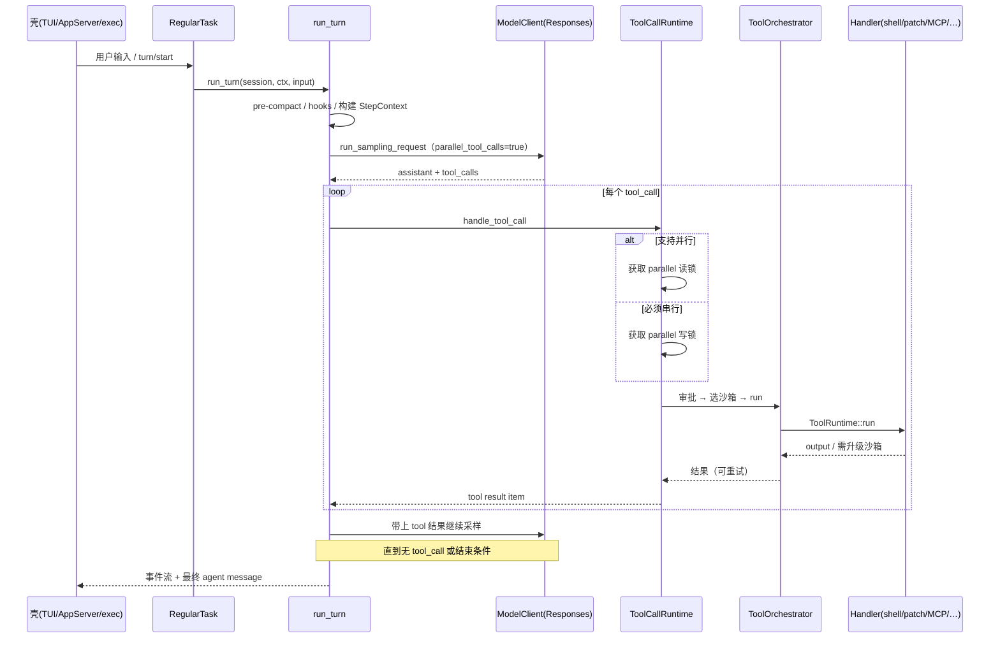

# 一轮 Turn 到底怎么跑（源码级）

本文按「真实调用链」拆一轮对话。文件均相对 `codex-rs/`。

## 总时序

## 1. 任务入口：`RegularTask`

文件：`core/src/tasks/regular.rs`

- 实现 `SessionTask`
- `run` 里先 `emit_turn_started`，处理 startup prewarm
- 然后循环调用 `session::turn::run_turn(...)`
- 若模型要求 follow-up / 工具后续，会带着 `next_input` 再进 `run_turn`

含义：外层 Task 管生命周期；真正「想一步、干一步」在 `run_turn`。

## 2. 编排心脏：`run_turn`

文件：`core/src/session/turn.rs` · 函数 `run_turn`（约 L163+）

启动阶段大致包括：

1. Guardian 输入检查（若适用）
2. 排空上一轮异步 hook 结果
3. **采样前 compact**（`run_pre_sampling_compact`）——避免上下文爆掉
4. 解析用户输入里提到的 plugin / 所需 MCP
5. `capture_step_context_with_required_mcp_servers` —— 冻结本回合工具表与配置快照
6. hooks + 记录用户输入
7. `build_prompt` / `run_sampling_request` —— 调模型

采样配置里明确有 **`parallel_tool_calls: true`**（同文件 `build_prompt` 附近），说明协议层就按「可并发工具」设计。

## 3. 工具调度：`ToolCallRuntime`

文件：`core/src/tools/parallel.rs`

关键逻辑（`handle_tool_call_with_source`）：

- 问 router：`tool_supports_parallel(&call)`
- **支持并行** → `RwLock` **读锁**（多个工具可同时跑）
- **不支持** → **写锁**（独占，避免和其它工具打架）
- 再 `router.dispatch_tool_call_with_terminal_outcome(...)`
- 带 cancellation / abort / 耗时埋点

这是「编排牛」的第一现场：不是简单 `for tool in tools: await`，而是 **按工具语义做并行门控**。

## 4. 单工具策略：`ToolOrchestrator`

文件：`core/src/tools/orchestrator.rs`（文件头注释写得很直白）

固定流水线：

1. **Approval**（该不该问用户 / 策略是否自动过）
2. **Select sandbox**（只读 / workspace-write / 升级…）
3. **Attempt** 执行
4. 若沙箱拒绝 → **escalated sandbox 重试**（审批结果可缓存，避免反复弹窗）
5. 联网场景还有 **network approval**（托管网络策略）

对比「裸跑 shell 的 agent」：Codex 把安全策略嵌进编排，而不是事后补救。

## 5. 路由与实现：`ToolRouter` + `handlers/`

- `tools/router.rs`：`ToolCall { tool_name, call_id, payload }` → 分发
- `tools/registry.rs`：注册表；PreToolUse / PostToolUse hooks 包在执行外
- `tools/handlers/`：真实能力
  - `apply_patch*`：改代码
  - shell / unified_exec 相关 runtime：跑命令
  - `mcp*`：外部工具生态
  - `multi_agents*` / `multi_agents_v2*`：**子 agent 编排**（spawn / 发消息 / followup）
  - `plan*`、`request_permissions*`、`request_user_input*`：计划与人机交互

多 agent 不是另起炉灶的产品，而是 **同一 tool 体系里的一等工具**。

## 6. 壳如何接到这条链

### App Server

- `app-server/src/message_processor.rs`：识别 `thread/start` | `turn/start` 等
- 事件经 outgoing / bespoke handlers 回传；审批通过 `submit(Op::ExecApproval { … })` 等回到 core

### `codex exec`

- 非交互复用同一 harness
- `--json` 输出 JSONL（`thread.*` / `turn.*` / `item.*`）
- 适合当工作流引擎的一步 worker

## 7. 学习时怎么下断点（思路）

不必上调试器也能「脑内断点」：

1. 在 `regular.rs` 确认进入 `run_turn`
2. 在 `run_turn` 找第一次 `run_sampling_request`
3. 在 `parallel.rs` 看本次 tool 拿的是读锁还是写锁
4. 在 `orchestrator.rs` 看审批决策与 sandbox 类型
5. 在对应 `handlers/*.rs` 看副作用（写文件 / 跑命令 / MCP）

## 8. 容易迷路的点

- `core` 很大；**不要**从 `tui/src/chatwidget.rs` 开始学编排
- Turn 内可能多次采样；「一次用户回车 ≠ 一次 HTTP」
- StepContext 冻结工具表：中途 MCP 变化不一定立刻进当前 step
- 并行不是全局乱并行：不支持并行的工具会堵住写锁
